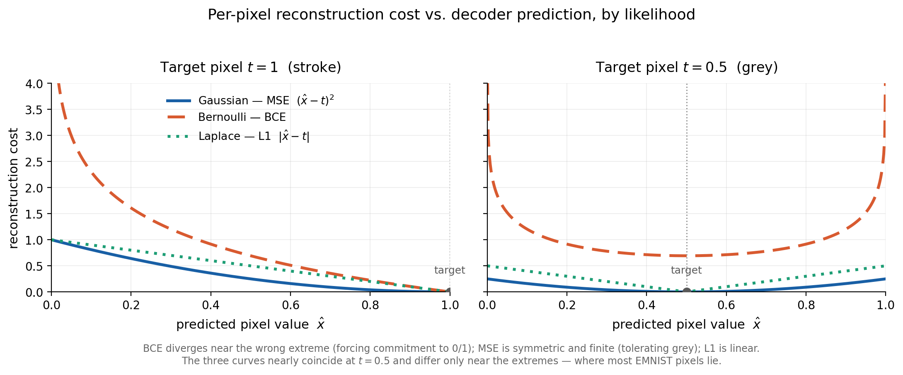

# Choice of Likelihood Model

The choice of likelihood $\tilde{\rho}_{X|Z}(x, z)$ determines the form of the reconstruction term $R$ in the objective function, since $R$ corresponds to the negative log-likelihood. Each choice encodes a different assumption about the distribution of the pixels and yields a distinct loss. The figure below shows, for a fixed target pixel, the reconstruction cost as a function of the value predicted by the decoder, for the three options considered.

The figure highlights the signature of each loss: the MSE (Gaussian) is symmetric and finite; the BCE (Bernoulli) grows without bound as the prediction approaches the wrong extreme; and the L1 (Laplace) grows linearly. The three curves nearly coincide when the target pixel is at $0.5$, diverging only near the extremes $0$ and $1$ — precisely the region where the vast majority of EMNIST pixels lie.

## Comparison of the Options

### Gaussian likelihood (MSE loss)

This corresponds to the formulation derived in the theory, in which fixing $\sigma_D = 1$ reduces the reconstruction term to the squared error $\|x - \mu_D(z)\|^2$. Its main advantages are the direct connection to the mathematical development and the smoothness of the loss, which is differentiable everywhere. Its disadvantage is the tendency to produce blurry reconstructions: because the penalty is symmetric and exerts no pressure toward the extremes, the decoder, when faced with ambiguity, tends to predict the mean value (grey), which smooths out the strokes.

### Bernoulli likelihood (BCE loss)

This matches the near-binary nature of the EMNIST images, where the background is approximately $0$ and the strokes approximately $1$. Since the loss grows without bound near the wrong extreme, it forces the decoder to commit to values close to $0$ or $1$, resulting in sharper reconstructions. It is the most common choice for data of this kind and the one that tends to deliver the best practical performance. As a limitation, the Bernoulli distribution is formally defined over the set $\{0, 1\}$ rather than the continuous interval $[0, 1]$; when applied to continuous pixels, the BCE is used as a loss function without strict normalization of the density (the *continuous Bernoulli* variant corrects this, although in practice the standard BCE is sufficient). Moreover, its advantage depends on the binary nature of the data and does not carry over to images with genuine continuous gradients.

### Laplace likelihood (L1/MAE loss)

Because it has heavier tails than the Gaussian, it penalizes large errors less severely, preserving edges better and producing less blur than the MSE, while also being more robust to outliers. Its disadvantages are that it does not exploit the binary nature of the data — making it inferior to the Bernoulli in this setting — and that the loss is non-differentiable at zero, requiring the use of a subgradient.

## Decision

We adopted the **Bernoulli (BCE)** likelihood as the primary model, as it is the most compatible with the binary nature of EMNIST and produces the sharpest reconstructions. The **Gaussian** likelihood was used as a comparative baseline, given its direct correspondence with the theoretical formulation. The **Laplace** likelihood was considered as a secondary alternative.

It is worth noting that the choice of likelihood affects only the reconstruction term $R$; the latent regularization term $L$ (the KL divergence) remains unchanged. Therefore, changing the likelihood mitigates but does not eliminate the blur characteristic of VAEs, part of which stems from the regularization of the latent space and the stochastic sampling of the latent code.